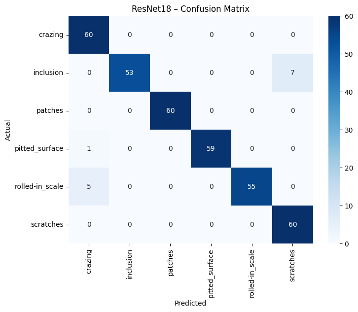
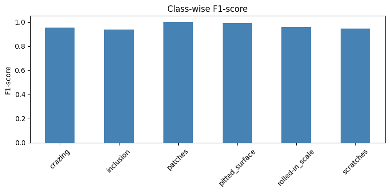
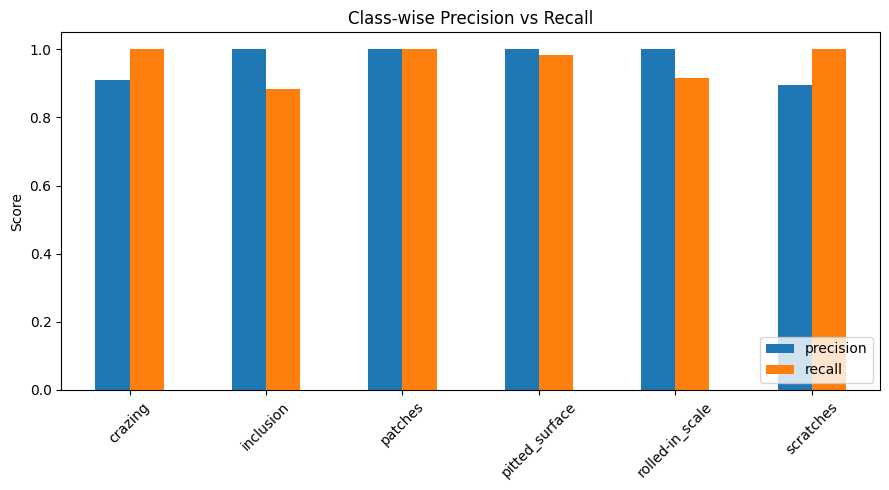
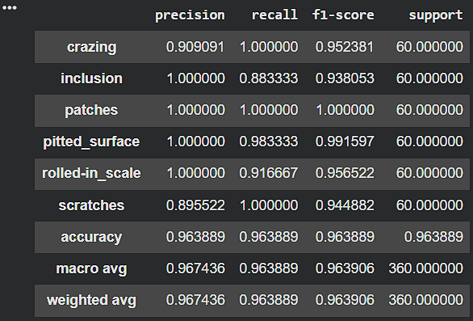
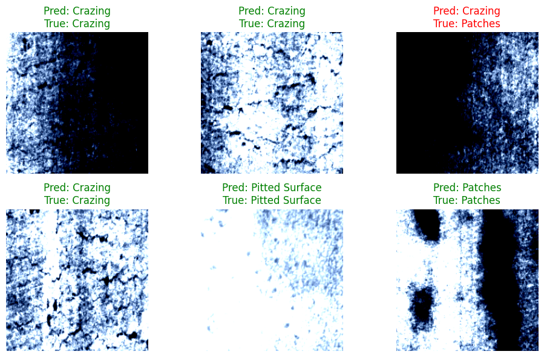

# 🧠 Metal Surface Defect Classification using CNN

## 🚀 Overview

Manual inspection of metal surfaces is time-consuming and prone to human error. This project builds a deep learning model to automatically classify surface defects, improving industrial quality control.

---

## 🧠 Problem

Manufacturing industries require accurate defect detection to maintain product quality. Traditional inspection methods are inefficient and inconsistent.

---

## ⚙️ Approach

* Built a Convolutional Neural Network (CNN) using PyTorch
* Preprocessed grayscale image dataset
* Applied data augmentation to improve generalization
* Trained model on 6 defect classes
* Evaluated performance using accuracy and confusion matrix

---

## 📈 Results

* Accuracy: **96.4%**
* High classification performance across multiple defect classes

---

## 📊 Model Performance






---

## 🖼️ Sample Predictions



👉 Green = correct prediction
👉 Red = incorrect prediction

---

## 🔍 Key Insights

* CNN effectively captures spatial patterns in defect images
* Data augmentation significantly improves model performance
* Some defect types are visually similar, leading to occasional misclassification

---

## 🔄 Pipeline

1. Data preprocessing
2. Image transformation & augmentation
3. CNN model training
4. Model evaluation
5. Prediction on unseen images

---

## 📦 Dataset

This project uses the NEU Metal Surface Defect Dataset from Kaggle:
https://www.kaggle.com/datasets/kaustubhdikshit/neu-surface-defect-database

Classes:

* Crazing
* Inclusion
* Patches
* Pitted Surface
* Rolled-in Scale
* Scratches

---

## 🚀 Production Perspective

If deployed in manufacturing systems:

* Real-time defect detection using camera feeds
* Automated quality inspection pipelines
* Integration with industrial monitoring systems
* Dashboard for defect analytics

---

## 🛠 Tech Stack

Python, PyTorch, CNN, NumPy, Matplotlib

---

## ▶️ How to Run

```bash
git clone https://github.com/madhavgrover10/defect-classification-cnn
cd defect-classification-cnn
pip install -r requirements.txt
```

Run:

```bash
notebooks/metal_surface_defect_classification.ipynb
```

---

## 📂 Project Structure

* notebooks/ → training & evaluation
* images/ → visual outputs

---

## 📬 Contact

LinkedIn: https://linkedin.com/in/madhav-grover-a126b1226
Email: [grovermadhav@gmail.com](mailto:grovermadhav@gmail.com)
